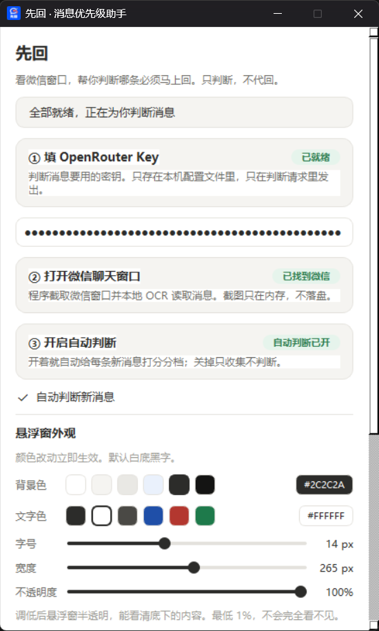
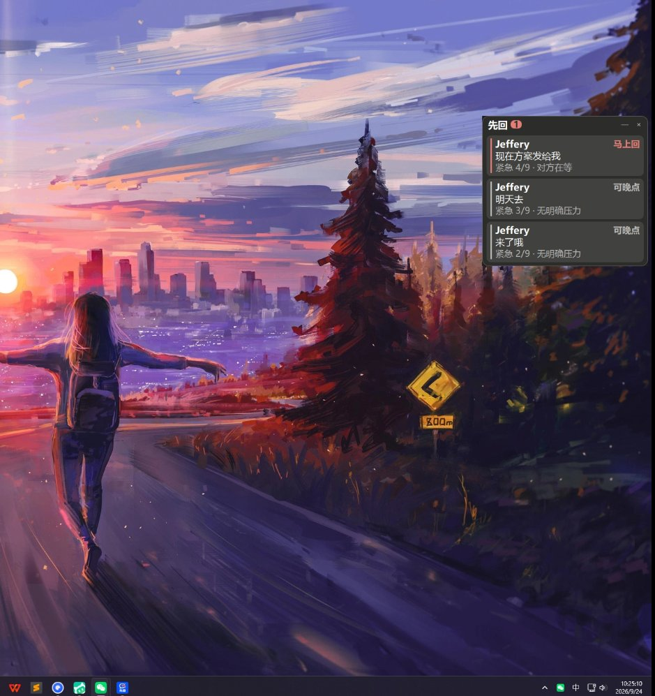

# 先回 · Windows 版

> 微信消息太多，分不清哪条非回不可？让 AI 告诉你先回哪个。

**先回**（Windows 版）：**截取微信窗口 → 本地 OCR 读出对方的消息 → 判断哪条必须马上回 → 结果放在屏幕边缘的悬浮窗里**。点某条即可跳到微信去回。

和 Android 版是同一套判断口径、同一套分档规则。

**由 [Jev](https://github.com/typesafeinc/jev) 判断模型驱动**（TypeSafe 的 System One 决策模型，不是大语言模型）—— 它不生成文字，只回答「选哪个 / 打几分 / 是不是」，所以一次判断约 1 秒、约 $0.00004。

## 界面预览





## 特性

- **只判断，不代回** —— 不生成回复文字，只告诉你先看哪条
- **三档分色** —— 要马上回（红）/ 尽快（黄）/ 可以晚点（灰），最多同时展示 5 条
- **点击即跳转** —— 点悬浮窗里的一条，直接切到对应的聊天应用（自动识别微信 / QQ / 钉钉等）
- **全程离线识别** —— RapidOCR 本地跑，截图只在内存、不上传
- **可拖动悬浮窗** —— 松手自动吸附屏幕边缘，可折叠成计数条，外观（颜色 / 字号 / 宽度 / 不透明度）可调
- **开机自启** —— 设置里一键开启，不需要管理员权限

## 快速开始

**只想用**：下载 `XianHui-Setup.exe` 双击安装 → 打开程序 → 填 OpenRouter Key → **保持微信聊天窗口可见** → 点「开始监听」。

**从源码跑**：

```bash
python -m venv .venv
.venv\Scripts\pip install -r requirements.txt
.venv\Scripts\python main.py
```

需要 Python 3.10+（开发环境为 3.13）。打包与部署见 [docs/DEPLOY.md](docs/DEPLOY.md)。

## 已知限制

- **微信窗口必须保持可见** —— Windows 没有系统级消息通知接口，只能截取微信窗口做本地识别。最小化或关闭后窗口没有渲染画面，截图结果是空白。**这是 Windows 截图机制的固有约束，不是本程序的缺陷**（悬浮窗会给出提示）
- **微信改版可能失效** —— 解析依赖左右气泡的相对位置，大改布局需重新校准 `capture/parser.py`
- **图片 / 表情包读不出内容** —— OCR 只认文字
- **列表不持久化** —— 重启程序后清空（有意为之，避免留下聊天痕迹）
- **初次启动稍慢** —— OCR 模型首次加载需要一两秒

## 隐私与合规

- API Key 只存 `%APPDATA%\JevPriority\config.json`，只在判断请求里随附
- 截图只在内存，**不落盘、不进日志**；消息原文只在判断那一刻发给模型接口
- 无统计、无埋点、无上报；唯一的网络出口是 `core/jev_client.py` 里那一个 POST，可自行抓包验证
- 只读取**自己屏幕上、自己账号的**聊天内容。不注入微信、不 hook、不解密数据库、不自动发送、不修改微信任何数据

请在自己拥有或已获授权的设备上使用，遵守各软件用户协议与当地法律法规。

## 来源

复用 [jev-chat-jarvis](https://github.com/jev-chat/jev-chat-jarvis) 的判断契约（`noul / choice / score`）；采集思路借鉴 [jev-chat-windows](https://github.com/jev-chat/jev-chat-windows) —— 微信 4.x 界面自绘在 GPU 画布上、UIA 读不到控件，截图 + OCR 是唯一干净的路径；生成层已删除，本应用是纯判断型工具。

## 许可

[MIT](LICENSE)
