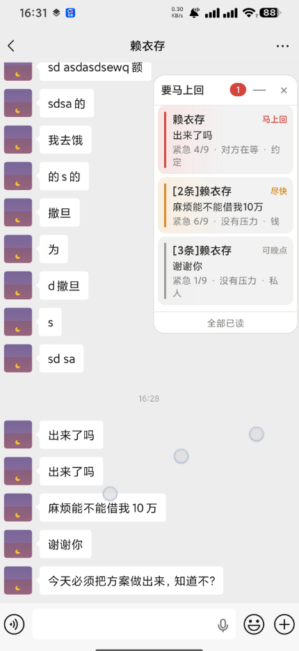
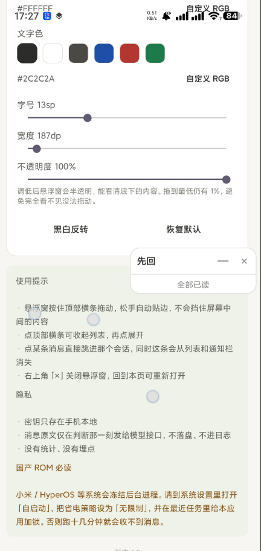

# 先回 · Windows 版

> 微信消息太多，分不清哪条非回不可？让 AI 告诉你先回哪个。

**先回**（Windows 版）：**截取微信窗口 → 本地 OCR 读出对方的消息 → 判断哪条必须马上回 → 结果放在屏幕边缘的悬浮窗里**。默认贴在屏幕左边，点某条即可清除。

和 Android 版是同一套判断口径，同一套分档规则（`core/` 目录平台无关，两端共用同样的题目）。

**由 [Jev](https://github.com/typesafeinc/jev) 判断模型驱动**（TypeSafe 的 System One 决策模型，不是大语言模型）—— 它不生成文字，只回答"选哪个 / 打几分 / 是不是"，所以一次判断约 1 秒、约 $0.00004。

## 本项目参考与二次开发来源

本项目由 **[jev-chat-jarvis](https://github.com/jev-chat/jev-chat-jarvis)** 开源代码进行二次开发而完成。准确地说，是**复用它的判断契约、替换它的采集方式、删除它的生成层**：

| 维度 | 与 jev-chat-jarvis 的关系 |
| --- | --- |
| 模型调用契约 | **复用** —— 沿用 `noul / choice / score` 三种题型的请求与解析格式 |
| 题目设计口径 | **同源** —— 本题的四道题由它的七道题按需裁剪改写 |
| 采集方式（Windows） | **借鉴** —— 窗口截图 + 离线 OCR，思路来自 [jev-chat-windows](https://github.com/jev-chat/jev-chat-windows)（因为微信 Windows 4.x 界面自绘在 GPU 画布上、UIA 读不到控件，截图 + OCR 是唯一干净的路径） |
| 生成层 | **删除** —— 它用大模型起草候选回复，本应用完全不生成文字 |
| 产品形态 | **不同** —— 它回答"该怎么回"，本应用回答"先回哪个" |

关键在于：**jev-chat-jarvis 是"Jev 判断 + DeepSeek 生成"的双模型架构，本应用只保留 Jev 那一层，是一个纯判断型工具。**

相关生态：

| 项目 | 平台 | 链接 |
| --- | --- | --- |
| jev-chat-jarvis | Android | https://github.com/jev-chat/jev-chat-jarvis |
| jev-chat-mac | macOS | https://github.com/jev-chat/jev-chat-mac |
| jev-chat-windows | Windows | https://github.com/jev-chat/jev-chat-windows |

```
    ╭────────────────────────╮
    │ 要马上回  ②       —  × │   ← 拖顶部横条移动，松手自动贴边
    ├────────────────────────┤
    │▌同事              马上回│   ← 红
    │ 方案今天能发我吗        │
    │ 紧急 8/9 · 对方在等     │
    │                        │
    │▌妈妈                尽快│   ← 黄
    │ 周末回来吃饭吗          │
    │ 紧急 5/9 · 约定         │
    ╰────────────────────────╯
```

点「—」收起成一条只有计数的小横条。

## 界面预览

**悬浮窗**（贴在屏幕边缘，显示待处理消息按紧急度排序）：



**主界面**（三张状态卡 + 队列计数）：


**外观设置**（文字色 / 字号 / 宽度 / 不透明度可调）：



## 特性

- **只判断，不代回** —— 帮你决定优先级，回复永远由你自己发
- **不碰微信客户端** —— 只截自己窗口的图，不注入、不 hook、不解密数据库、不自动发送
- **截图只在内存** —— 不落盘、不进日志；唯一出网的是判断请求里的那段文字
- **本地离线 OCR** —— RapidOCR（ONNX）在本地跑，图片不上传任何云
- **可拖动悬浮窗** —— 松手自动贴边不挡内容，可折叠成计数条
- **外观可自定义** —— 背景色 / 文字色 / 字号 / 宽度 / 不透明度都能改，RGB 自选，默认白底黑字
- **消息不落盘** —— 只在判断那一刻发给模型，不留历史
- **托盘常驻** —— 关掉主窗口不退出，托盘图标随时唤回
- **极低成本** —— 每天 200 条消息约半分钱

## 快速开始

**只想用**：下载 `XianHui-Setup.exe` 双击安装 → 打开程序 → 填 OpenRouter Key → 打开微信聊天窗口 → 点「开始监听」。

**从源码跑**：

```bash
python -m venv .venv
.venv\Scripts\pip install -r requirements.txt
.venv\Scripts\python main.py
```

需要 **Python 3.10+**（开发环境为 3.13）。

**打安装包**（需要 [Inno Setup 6](https://jrsoftware.org/isdl.php)）：

```bat
packaging\build_installer.bat
```

产物：`packaging\output\XianHui-Setup.exe`。

完整说明见 **[docs/DEPLOY.md](docs/DEPLOY.md)**。

## 界面与操作

**主界面**是三张状态卡，每张独立显示自己的状态：未完成时是红色徽章 + 按钮，完成后变绿徽章、按钮自动消失。顶部一条总览直接告诉你"还差几步"。

**悬浮窗**操作：

| 操作 | 效果 |
| --- | --- |
| 按住顶部横条拖动 | 移动位置，**松手自动吸附到最近的屏幕边缘** |
| 点「—」 | 收起 / 展开列表 |
| 点某条消息 | 从列表移除该条（回复请回微信里发） |
| 点「×」 | 关闭悬浮窗，主界面可重新打开 |

颜色含义：**红=马上回**，**黄=尽快**，**灰=可以晚点**，**蓝=正在判断**。

## 悬浮窗外观

主界面底部「悬浮窗外观」一栏可以改五项，改动**立即生效**，无需重启：

| 项目 | 范围 | 默认 |
| --- | --- | --- |
| 背景色 | 6 个预设色块 + RGB 自选 | `#FFFFFF` 白 |
| 文字色 | 6 个预设色块 + RGB 自选 | `#2C2C2A` 近黑 |
| 字号 | 10 – 20 px | 12 px |
| 宽度 | 180 – 340 px | 220 px |
| 不透明度 | 1 – 100 % | 100 % |

另有两个快捷按钮：**黑白反转**（一键交换前景/背景，做深色模式）和**恢复默认**。

**不透明度**调低后整块悬浮窗半透明，能看清底下的微信而不挡住内容。最低 1% 而不是 0 —— 完全透明的卡片仍然会接收点击，却看不见也拖不动。它作用在**整个窗口**上（不是逐个控件），所以卡片底色、文字、颜色条一起淡出，没有叠加接缝。拖动滑杆时只改窗口透明度、不重建列表，所以不闪也不丢滚动位置。

> 一个 Qt 的坑：窗口还没 `show()` 时调用 `setWindowOpacity()` 会被静默丢弃（原生窗口尚未创建）。悬浮窗是启动时构建、之后才显示的，所以透明度在 `showEvent` 里会重新应用一次，否则重启后保存的透明度会失效。

### 高度随内容伸缩

悬浮窗**没有固定高度**，它随队列长度变化：

| 状态 | 列表高度 |
| --- | --- |
| 没有消息 | **40 px**（一条细条，只放一行提示） |
| 有消息 | 按实际行高累加，逐条长高 |
| 消息很多 | 封顶 340 px，再多就**在卡片内滚动**，不再继续变高 |

空着的时候它是一条很细的条，不会占掉小半个屏幕。上限 340 px 是防止消息堆积时把屏幕盖满。

空闲高度会随字号微调（字号 18 以上涨到 42–45 px），否则那行提示在大字号下会被裁掉。

你只选两个颜色就够了 —— 行底色、描边、次要文字、四个优先级强调色全部由这两个颜色**推导**出来（见 `core/appearance.py`）。所以深色底会自动用浅色强调色，浅色底用深色强调色，不会出现"深色底上看不清红点"的情况。

设置界面会实时检查对比度：低于 3:1 提示"几乎看不清"，低于 4.5:1 提示"偏低"，但**不会阻止你选**。

> 两端配色**各自独立保存**：Windows 存在 `%APPDATA%\JevPriority\config.json`（`overlay_bg` / `overlay_fg` / `overlay_font_size` / `overlay_width` / `overlay_opacity`），Android 存在 SharedPreferences，互不同步。

## 工作原理

```
微信窗口
   ↓  PrintWindow（只截自己窗口，不截全屏）
  位图（仅在内存）
   ↓  RapidOCR 离线中文识别
  文字行 + 坐标
   ↓  定位会话列表与聊天窗格的分界线，只保留窗格内的文字
   ↓  左侧气泡 = 对方 → 取最新一条
  一次请求问 Jev 四件事：
  ┌────────────────────────────────────┐
  │ 1. 紧急度？        → 打 1–9 分      │
  │ 2. 要马上回？      → 是 / 否        │
  │ 3. 什么类型？      → 工作/私人/推广… │
  │ 4. 为什么急？      → 有时限/对方在等… │
  └────────────────────────────────────┘
   ↓  分档 → 悬浮窗显示（红 / 黄 / 灰）
```

微信窗口是 `[导航栏][会话列表][聊天窗格]` 三栏结构。只有**聊天窗格**里才是消息，
所以解析前先从截图里找出会话列表与聊天窗格之间的那道分界线，把它左边的文字全部丢掉；
否则会话列表里的「折叠置顶聊天」「群名」会被当成发信人。窗格底部的输入框区域同样排除，
避免把「按住鼠标语音输入文字」这种占位提示读成一条消息。

分档规则（`core/msg_item.py`，与 Android 完全一致）：

| 紧急度 | 分档 | 颜色 |
| --- | --- | --- |
| 要马上回，或 ≥ 7 分 | **马上回** | 红 |
| ≥ 4 分 | 尽快 | 黄 |
| < 4 分 | 可以晚点 | 灰 |
| 还没判断完 | 判断中 | 蓝 |

## 和 Windows 参考项目的区别

| | jev-chat-windows | 本应用 |
| --- | --- | --- |
| 目标 | 读消息 → 生成候选回复 → 填入 | **读消息 → 判断要不要马上回** |
| 产出 | 3 条草稿 | **一个优先级排序** |
| 写入微信 | 会填入候选（发送仍手动） | **完全不碰，零写入** |
| 采集 | WGC 截窗 + OCR | 同样截窗 + OCR |

采集层一样，产品形态不同：它帮你"怎么回"，本应用帮你"先回哪个"。

## 项目结构

```
core/                      # ★ 平台无关判断内核（与 Android 同口径）
├── msg_item.py            #   一条待处理会话 + 紧急度分档规则
├── store.py               #   内存列表、排序、多监听者变更通知
├── questions.py           #   ★ 四道判断题 —— 效果主要看这里
├── jev_client.py          #   调模型并解析（唯一网络出口）
├── appearance.py          #   ★ 悬浮窗配色推导（只存两个颜色，其余算出）
└── settings.py            #   设置（密钥存 %APPDATA%\JevPriority）
capture/                   # 采集层
├── window.py              #   定位微信窗口 + PrintWindow 截图（含无响应窗口超时保护）
├── ocr.py                 #   离线 OCR（RapidOCR）
├── parser.py              #   从 OCR 行解析出「发送者 + 最新消息」
└── worker.py              #   截图→OCR→判断的后台循环（结构签名变化检测）
ui/                        # 界面层
├── overlay.py             #   可拖动悬浮窗（贴边 / 折叠 / 整行点击）
├── settings_window.py     #   三张状态卡与状态总览
└── theme.py               #   配色与样式
main.py                    # 入口：托盘、窗口与采集线程的装配
resources.py               # 资源定位（兼容开发态与 PyInstaller 打包态）
assets/                    # 图标资源（由根目录 icon.png 生成）
├── app.ico                #   多尺寸应用图标（16~256，exe 内嵌 + 运行时加载）
└── app_icon_256.png       #   256px PNG（备用/文档）
packaging/                 # 打包
├── build_installer.bat    #   一键打包脚本
└── installer.iss          #   Inno Setup 安装脚本
```

**想改进判断质量，只需要动 `core/questions.py` 一个文件。**

## 应用图标

图标源文件为仓库根目录的 `icon.png`（1920×1920），由 `tools/make_icons.py` 生成多尺寸规格：

| 用途 | 位置 | 说明 |
| --- | --- | --- |
| exe 文件图标 | `assets/app.ico` | 16/24/32/48/64/128/256 七档，由 PyInstaller `icon=` 内嵌 |
| 运行时图标 | `assets/app.ico` 优先，回退 `app_icon_256.png` | 托盘、窗口标题栏、Alt+Tab |
| 安装包图标 | `assets/app.ico` | Inno Setup `SetupIconFile`，同时用于「添加/删除程序」列表 |

接入点：

- `jev.spec` — `EXE(..., icon="assets/app.ico")`，并把 assets 加入 `datas` 随包分发
- `main.py` — `_app_icon()` 通过 `resources.asset()` 定位图标；`app.setWindowIcon()` 设置应用级图标
- `packaging/installer.iss` — `SetupIconFile=..\assets\app.ico`；快捷方式显式指定 `IconFilename`

重新生成：

```bash
python ../tools/make_icons.py
```

> 注意：源图 `icon.png` 四角是白色（非透明），且**没有一个透明像素**。脚本用圆角矩形几何蒙版处理圆角外区域，得到透明圆角图标。**不要**改用"接近白色就替换"的判定逻辑——那会把图标内部的白色气泡和「先回」文字一起抹掉。

## 技术栈

| | |
| --- | --- |
| 语言 | Python 3.10+（开发环境 3.13） |
| 界面 | PySide6（Qt 6） |
| 采集 | ctypes + user32 `PrintWindow`（WGC 思路） |
| OCR | RapidOCR（ONNX Runtime，离线） |
| 打包 | PyInstaller（onedir）+ Inno Setup 6 |

## 已知限制

- **微信改版可能失效** —— 解析依赖左右气泡的相对位置，大改布局需重新校准 `capture/parser.py`
- **图片/表情包读不出内容** —— OCR 只认文字
- **需要微信窗口可见** —— Windows 没有系统级消息通知接口，本程序只能截取微信窗口做本地识别，
  所以微信窗口必须处于可见（非最小化）状态。最小化后窗口没有渲染画面，截图结果是空白。
  这是 Windows 截图机制的固有约束，不是本程序的缺陷
- **不持久化** —— 重启程序列表清空（有意为之，避免留聊天痕迹）
- **初次启动稍慢** —— OCR 模型首次加载需要一两秒

## 隐私

- API Key 只存 `%APPDATA%\JevPriority\config.json`，只在判断请求里随附
- 截图只在内存，**不落盘、不进日志**
- 消息原文只在判断那一刻发给模型接口，**不留历史**
- 无统计、无埋点、无上报
- 唯一的网络出口是 `core/jev_client.py` 里那一个 POST，可自行抓包验证

## 合规

只读取**自己屏幕上、自己账号的**聊天内容。不注入微信、不 hook、不解密数据库、不自动发送、不修改微信任何数据。

请在自己拥有或已获授权的设备上使用，遵守各软件用户协议与当地法律法规。微信客户端改版可能导致识别失效。

## 许可

[MIT](LICENSE)

---

**关键词**：先回 · Windows 消息优先级 · 微信消息分类 · AI 帮你判断要不要回 · 窗口截图 OCR · RapidOCR · Jev 判断模型 · 悬浮窗 · PySide6
